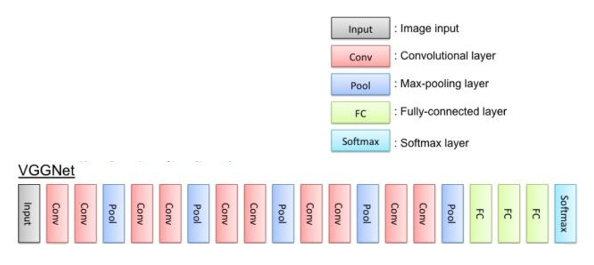

Kaggle 机器学习竞赛

# 迁移学习
## what?
利用已训练好的模型作为新模型的初始化学习方式

比如利用vgg 得到的千分类结果，我们叫做预训练权重。
然后我们在后面添加学习权重，将其变为二分类。

## why
- 所需的样本数量少
- 达到收敛所需耗时更短

## when
- 当新数据集比较小且和原数据集相似
- 当算力有限时

## how
1. 当新数据集比较小且和原数据集相似 
只训练softmax层，即冻结前面所有层，视为特征提取器，只处理softmax。
2. 当有一定算力时，可以训练部分参数
即冻结前面大部分浅层，只训练后几个深层参数。
3. 有足够算力和样本时
训练全部层。迁移目的只是做一个初始化操作

对于计算机视觉而言，大部分时候都用迁移学习。除非你有非常非常大的样本集和足够的算力。

# Dogs vs Cats
利用给定数据集，实现猫/狗识别。
训练集 猫狗各 12500张。
测试集 猫狗一共12500张。
下载地址  https://www.kaggle.com/c/dogs-vs-cats/data

# kaggle
pip3 install kaggle
账号申请 
my account - createnew api token
将下载好的json文件 放到 %userprofile%.kaggle内（可以通过运行kaggle生成该文件夹）
允许rules
更改下载地址：kaggle config set -n path -v C:\code
copy 命令并下载

实际下载速度很慢。。。我从百度云盘下的。。。

# VGG-16

VGG-16的网络很简单，有13个卷积层（被5个max-pooling层分割）和3个全连接层。所有卷积层的过滤器大小都是3×3，步长为1，进行padding。作者设置所有卷积层的过滤器大小都为3×3是有原因的，因为卷积核尺度更大的卷积层可以使用多个3×3卷积层来达到同样的效果，比如2个连在一起的3×3卷积层（步长为1）的接收域与5×5的卷积层的接收域一样。作者还给出了更多的解释，首先，使用多个3×3卷积层而不是相同接收域的一层卷积层，可以提高网络的分类能力（相当于添加了隐式的正则化）。第二，可以减少参数数量。

5个max-pooling分别在第2、4、7、10、13卷积层后面，池化效果是特征图长宽减少一半（filter 2×2，步长2）。作者并没有使用local response normalisation (LRN)，因为通过对比实验发现LRN并没有提高网络的表现，反而增加的网络的参数。

每次max-pooling之后，特征图的channel都会乘以2，从64开始，直到512，之后保持不变。

## 微调 finetuining
- 对于不需要训练的层设置 trainable = False
- 修改全连接层的神经元个数

## 载入权重
下载键值对文件，并剔除不需要的层，然后进行训练调整

[权重文件](https://www.cs.toronto.edu/~frossard/vgg16/vgg16_weights.npz )

[分类文件](https://www.cs.toronto.edu/~frossard/vgg16/imagenet_classes.py)

