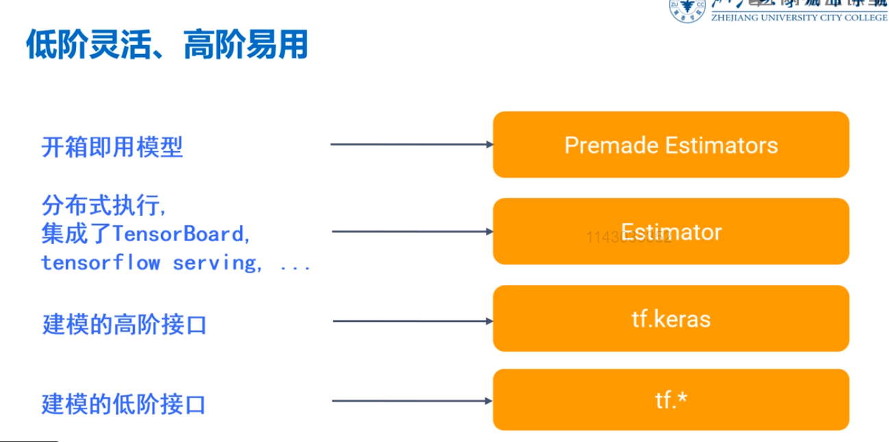

# 安装TensorFlow2.0
> conda create --name tf2 python=3.6 numpy
> activate tf2
> pip install -i https://pypi.tuna.tsinghua.edu.cn/simple scipy matplotlib numpy pandas tensorflow
> conda install nb_conda

我这里直接clone之前的,删除了Lib\site-packages里面的TensorFlow和numpy 然后
> pip install -i https://pypi.tuna.tsinghua.edu.cn/simple scipy matplotlib numpy pandas tensorflow==2.0.0
这块的坑主要是TensorFlow和python， numpy的版本关系太纠结了。也没人搞个官方文档出来
还有一个h5py的坑要改下。升级即可
> pip install h5py==2.8.0rc1

大功告成，搭环境真他么太有成就感了！

