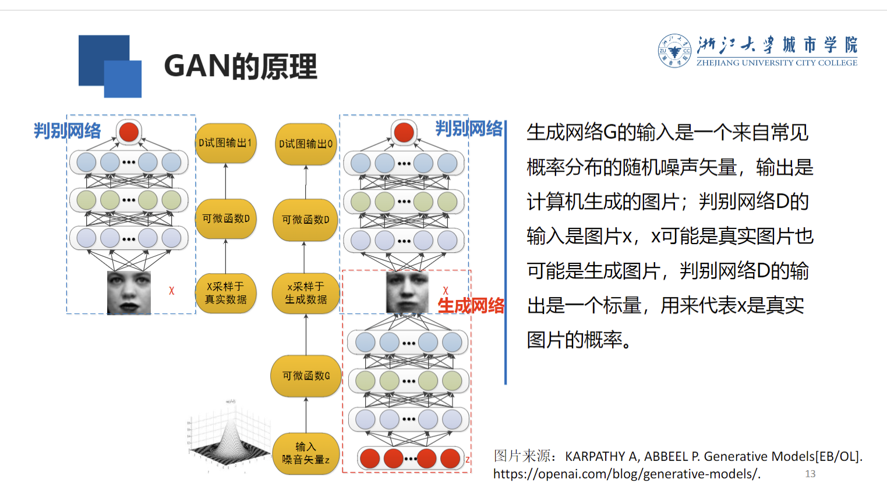

深度学习模型分为
- 判别式模型，如GoogleNet,ResNet, Faster, RCNN等，基于反向传播算法。用于高维度输入转换为低维度，如分类等。目前大多数研究成果都在判别式模型内
- 生成式模型 What I cannot create, I do not understand --Feynman。 通过观测现实样本，统计规律并生成类似样本

生成模型有最大似然估计，近似法，马尔科夫链法等等，大多复杂度较高，这里学习GAN(Generative Adversarial Networks)

生成器G 负责生成图片
常用卷积神经网络 DCGAN 对图片建模
尽量学习真实数据分布

判别器D 负责分类
二分类模型， 真实为1，伪造为0。
尽量正确判别输入数据时来自真实数据还是来自生成器

G&D各自提高自己的生成能力和判别能力，优化过程就是寻找二者之间的纳什均衡

G的损失函数Obj^G = -Obj^D。这是一个二元零和游戏。所以用交替优化思想：
- 固定生成器G优化判别器D，使D的准确率最大化
- 固定判别器D优化生成器G，使D的准确率最小化
当pdata = pg时达到全局最优

fashion-mnist和之前mnist很像也是10分类28*28灰度图。只是这里的分类是帽子等而非数字

运行方式 
> python main.py --dataset fashion-mnist --gan_type GAN --epoch 40 --batch_size 64 

CGAN conditional
都增加了一个条件变量c，这个条件可以是希望生成的标签
G: 必须生成和条件c匹配的样本
D: 不仅要判别图像是否真实，还要判别图像和条件c是否匹配

CGAN和GAN的区别只是输入多了一个条件。我们将标签作为输入一起放进去。网络不做修改

> python main.py --dataset fashion-mnist --gan_type CGAN --epoch 40 --batch_size 64 