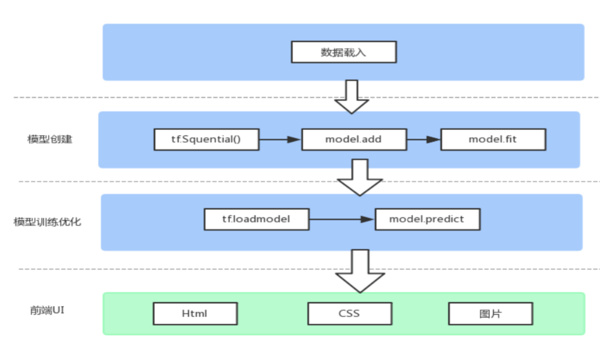

[api](https://js.tensorflow.org/api/latest/)
[tutorials](https://www.tensorflow.org/js/tutorials)

#### 张量
- 0阶 tf.scalar 
- 1阶 tf.tensor1d
- 2阶 tf.tensor2d

#### 变量
- 初始化 tf.variable
- 赋值 x.assign

# 构建模型
#### 手工
```javascript
function predict(input){
	// y = a * x + b
	return tf.tidy(()=>{
		const x = tf.scalar(input)
		const y = a.mul(x).add(b)
		
		return y
	})
}

const a = tf.scalar(2)
const b = tf.scalar(5)

const result = predict(2)
result.print()

```

#### tf.model
```javascript
// Define input, which has a size of 5 (not including batch dimension).
const input = tf.input({shape: [5]});

// First dense layer uses relu activation.
const denseLayer1 = tf.layers.dense({units: 10, activation: 'relu'});
// Second dense layer uses softmax activation.
const denseLayer2 = tf.layers.dense({units: 4, activation: 'softmax'});

// Obtain the output symbolic tensor by applying the layers on the input.
const output = denseLayer2.apply(denseLayer1.apply(input));

// Create the model based on the inputs.
const model = tf.model({inputs: input, outputs: output});

// The model can be used for training, evaluation and prediction.
// For example, the following line runs prediction with the model on
// some fake data.
model.predict(tf.ones([2, 5])).print();
```

#### 内存管理
- 张量.dispose() 内存释放
- tf.tidy() 设置一个作用域，里面函数执行完后，会释放内部资源，但会保存返回值

#### 保存模型方法
- cookie 不超过4KB 每次都会发送至服务器
- localStorage 2.5MB-10MB 每个浏览器不同，不提供搜索功能，不能自定义索引
await model.save('localstorage://')
- IndexedDB 允许存储大梁数据，提供查找接口，还能建立索引，IndexedDB不属于关系型数据库，不支持SQL查询语句，更类似NoSQL。
await model.save('indexeddb://')
- http(s) 下载模型  await model.save('http://')
- 文件下载 await model.save('downloads://')
- 文件系统下载 node环境下  await model.save('file://')

sepal 花萼 length*width
petal 花瓣 length*width
species 种类



数据 data.js
- 数据集 IRIS_DATA
- 划分数据x和标签y ，getIrisData
- 划分数据集为测试集test和样本集train，并将标签onehot化 convertToTensors 
数据载入 loader.js
- 载入模型 tf.loadModel
模型 index.js
这部分和keras语法很像，不太需要使用低阶tensorflow api
-  初始化 tfSquential()
-  添加隐层 model.add
-  定义优化器，损失函数等   model.compile({optimizer: optimizer,loss: 'categoricalCrossentropy',metrics: ['accuracy'],});
-  训练 model.fit
优化 index.js
- tf.loadmodel
- model.predict
前端 ui.js
- html + css + png